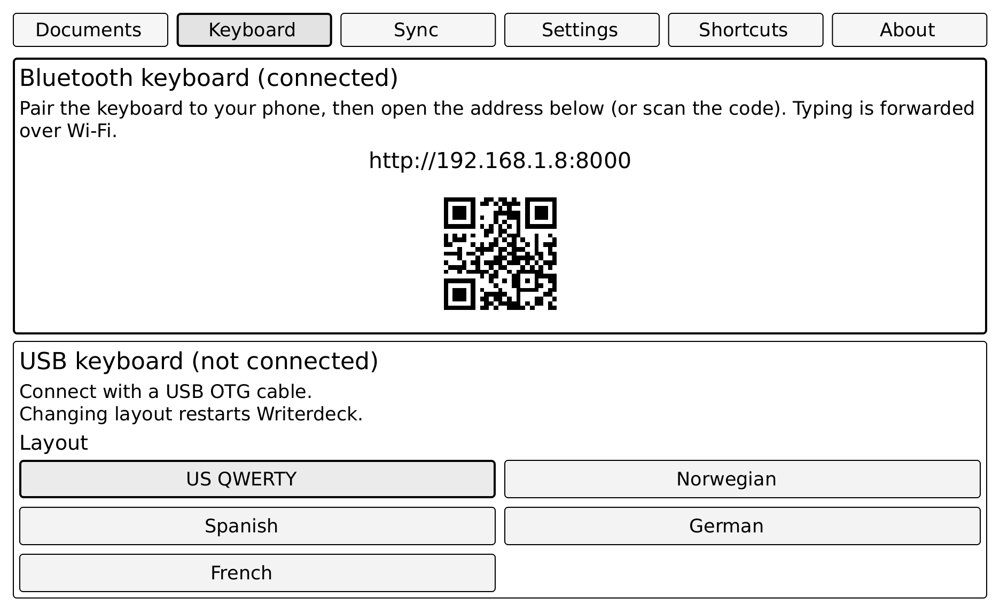

# Writerdeck for reMarkable 1

A distraction-free word processor for the first generation reMarkable. Supports Bluetooth and USB keyboards. Optionally syncs your documents to a private GitHub repository of your choice. Optionally encrypts files. Saves files as Markdown.

Natively, the reMarkable 1 supports the "draw", "write by hand" and "read" use cases. With this app, "use as typewriter" is also supported.

Bluetooth keyboards pair to your phone and bridge over Wi-Fi. USB keyboards use an [OTG cable](https://en.wikipedia.org/wiki/USB_On-The-Go#OTG_micro_cables).

<picture>
  <source media="(prefers-color-scheme: dark)" srcset="/img/Writerdeck-for-reMarkable-two-photos-dark-bg.jpg">
  <source media="(prefers-color-scheme: light)" srcset="/img/Writerdeck-for-reMarkable-two-photos-light-bg.jpg">
  
</picture>

The reMarkable 1 has a large e-ink screen and a quiet OS, but no word processor and no keyboard support. This fills the gap.



The project is heavily LLM-assisted and partly human-reviewed. Primary sources: Singleton’s [keywriter](https://github.com/dps/remarkable-keywriter) (forked as [Writerdeck-keywriter](https://github.com/bjornte/Writerdeck-keywriter)) and ideas from [crazy-cow](https://github.com/machinelevel/sp425-crazy-cow).

## Status

A usable appliance. As with any software there's improvement potential, but a whole lot is working as intended. Latest: five languages supported, both in UI and as USB keyboard layouts.

## Install

Need: a reMarkable **1** (not 2), a Mac or Linux computer on the **same Wi-Fi**, and the tablet **awake**.

1. [Download the installer](https://github.com/bjornte/Writerdeck-for-reMarkable/releases/download/installer/Writerdeck-installer.zip). Unzip it and open a terminal in that folder.

2. Run:

   ```bash
   bash scripts/install.sh --start
   ```

   It asks only for missing details (Wi-Fi IP, tablet password, optional GitHub document sync). Saved values in `secrets/remarkable.local.env` are reused. For sync it walks you through GitHub’s token page, then pushes repo / token to the tablet after start. Phone PIN defaults to off (`none`).

If you already cloned this repo, run the same command from the clone instead.

### You're done when

- Stock reMarkable UI is on the e-ink screen (Writerdeck opens only when you ask)
- On your phone, `http://<that-Wi-Fi-IP>:8000/` shows the keyboard shell and **Connected** (not stuck on `connecting...`)
- Optional check: both page buttons together (or `rmlobby`) open the Lobby

If Writerdeck is stuck or something looks wrong after a bad install:

```bash
systemctl disable --now writerdeck && systemctl start xochitl
```

(run that over SSH on the tablet). After a firmware update, the password changes and you may need to re-run the install steps above.

### Optional GitHub sync

Use a private personal repo. Conflicts keep both copies rather than overwrite. Set a fine-grained token with Contents read/write on that repo only. On the phone: Sync setup — turn sync on, enter `owner/repo`, paste the token. The token stays in the browser; a new Wi-Fi address is a new browser origin, so you may need to enter it again there.


## Everyday use

Power on — stock reMarkable UI. Open Writerdeck with both page buttons, USB Esc, phone **Show PIN on tablet**, or `rmlobby`. Lobby Files shows the connect address and PIN. About shows the product version and whether GitHub has a newer build. Open that address on the phone, enter the PIN, pair a keyboard to the phone if you like. The phone lands on the keyboard shell — keys go to the tablet. Open a document on the tablet to type on e-ink. Download starts from Lobby Files and asks the phone to save the file. Paste from phone inserts at the cursor. Font, PIN length, and rotation live in Lobby Settings.

Show the Lobby from a Mac on the same Wi-Fi with `rmlobby` (after `bash scripts/install-alias.sh`) or `bash scripts/lobby.sh`. Screen grab: `rmshot`. On the tablet: `~/wd`.

Useful keys: Esc toggles edit and preview inside Writerdeck, or launches to Lobby from the stock UI with a USB keyboard. Left and right page buttons together do the same launch without USB. Ctrl-C / Ctrl-X / Ctrl-V copy, cut, and paste. Lobby chords (including Sync ↩ and optional tab letters) live in `lobby-ui.json` on the tablet. Physical Home from edit returns to Files; from Lobby it quits to the stock UI (keyboard Home is caret only).

## For developers

Start with [TODO.md](TODO.md) and [DONE.md](DONE.md). Credentials: [secrets/README.md](secrets/README.md). Keep the tablet awake and iterate over Wi-Fi. After editor source changes: push, fetch the CI binary, deploy, run `test-edit-session.sh`. Rebuild the visitor installer ZIP with `bash scripts/pack-installer.sh`. Install notes: [docs/install-onboarding/](docs/install-onboarding/).

## Constraints

No jailbreak; keep OTA (over-the-air updates) — so no Toltec. One static Go binary on the tablet.

## Pieces

Writerdeck-server — always-on Go daemon: phone page, WebSocket, files, sync, PIN, key relay into `/run/Writerdeck.sock`.

Phone page — captures keys and talks to the server.

Writerdeck — full-screen editor from our keywriter fork. Saves Markdown under `Writerdeck-user-documents/`.

Keys use the socket because this kernel cannot load uinput. More: [docs/architecture.md](docs/architecture.md), [docs/decisions.md](docs/decisions.md).

## License

[MIT](LICENSE) © 2026 Bjørn Tennøe. Keywriter is third-party with its own license.
