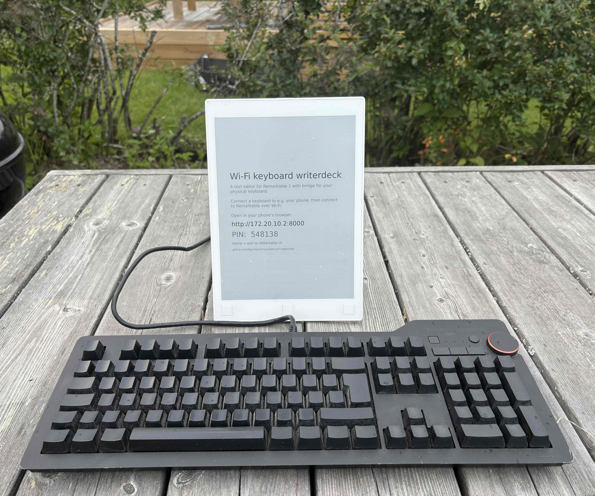
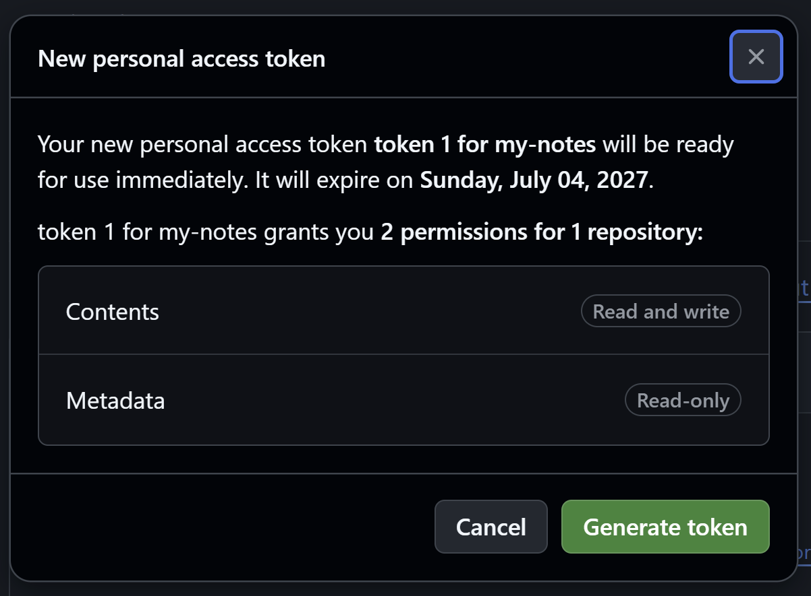

# Writerdeck for reMarkable 1

A text editor for the reMarkable 1, with a bridge for a physical keyboard. Pair a keyboard to another device — your phone, say — and type over Wi-Fi onto the tablet's e-ink, saving Markdown.



Background: The reMarkable 1 has a large, nice e-ink screen and a distraction-free OS, but no Bluetooth or keyboard support, and no way to create typed documents. This Writerdeck fills the gap.

See the [r/writerDeck](https://www.reddit.com/r/writerDeck/) community for more on distraction-free writing.

The project is 99% vibe coded and 1% code reviewed. I (the repo owner, Bjørn) have mostly just herded Claude and perused the documentation, not the code itself. Primary sources: the [keywriter](https://github.com/dps/remarkable-keywriter) editor (slightly patched) and a keypress injection approach in [crazy-cow](https://github.com/machinelevel/sp425-crazy-cow).

## How it works

```
Physical keyboard → phone → Wi-Fi → web server on reMarkable → Writerdeck editor
```

## Status

Work in progress, but already a usable appliance. Power on and the tablet boots into a welcome Lobby showing its address and a one-time PIN. Enter that PIN on your phone and you can browse & edit notes. Text entered on the phone's keyboard lands on the e-ink and saves as Markdown. Download or copy notes off the device, and vice versa.

## Installation guide for (expert) users

1. Clone this repo. Copy [secrets/remarkable.local.env.example](secrets/remarkable.local.env.example) to `remarkable.local.env` and fill in the device password (tablet: Settings → Help → Copyrights and licenses → General information).
2. `bash scripts/bootstrap.sh` — installs your SSH key on the tablet.
3. `bash scripts/fetch-keywriter-dist.sh` — downloads the CI-built editor (keywriter binary + Qt runtime) into `third_party/keywriter/dist/`. Source-only mirror: these aren't committed, so fetch them from CI first (needs `gh`: `brew install gh && gh auth login`).
4. `bash scripts/deploy-keywriter.sh` — ships the editor to the tablet.
5. `bash scripts/deploy-rmkbd.sh` — cross-builds and ships the `rmkbd` daemon.
6. `bash scripts/install-service.sh` (on the Mac) installs the systemd unit. Then SSH into the tablet (`ssh root@<ip>`) and run `systemctl start rm1-writerdeck` to test, then `systemctl enable rm1-writerdeck` to boot straight into it. Enable only after the test passes — see the script's boot-loop note.

### Optional: GitHub syncing of notes

Optionally, sync your notes towards GitHub. The assumed use case is to use a repo that's personal & private.

Edit conflicts never overwrite. The reMarkable's version is kept as `note (tablet copy).md`. A banner appears on the phone so you can reconcile.

If a note has edits on the reMarkable that haven't synced yet, deleting or renaming the note elsewhere keeps the note rather than removing it.

To set up the repo and enable syncing:

1. Here on GitHub, create a new private repo to hold your notes
2. Go to the [create token](https://github.com/settings/personal-access-tokens/new) page. Create a fine-grained personal access token with Repository access limited to just that repo and `Repository permissions` → `Contents: Read and write`. Copy the token.
3. On your phone, open ⚙ → GitHub sync: turn it on, enter the repo as `owner/repo`, and paste the token. The token is kept in that browser only.
3. The reMarkable tablet never sees the token. It only records whether sync is enabled and the name of the repo.



## How-to for users incl. shortcuts

1. Power on the tablet — it boots into a Lobby showing its address (`http://<ip>:8000`) and a one-time PIN.
2. Open that address in the phone's browser, and enter the PIN.
3. Pair a physical keyboard to your phone.
4. Tap a note to read it, or Edit to type — keystrokes land on the e-ink and save as `.md`. New makes a note; Rename / Delete / Download / Copy live in the read view; ⚙ picks the reading font and PIN length (6 / 4 / off).

Shortcuts:

- Esc — toggles edit / preview on the tablet.
- Ctrl-K — Switch note from within edit view.
- Ctrl-left/right — In preview mode, rotate screen (landscape/portrait)

## Getting started for devs

Development on the tablet is done over SSH from a machine on the same Wi-Fi. To get started:

1. [TODO.md](TODO.md), [DONE.md](DONE.md) etc. briefs on current status.
2. Create your local credentials: copy [secrets/remarkable.local.env.example](secrets/remarkable.local.env.example) to `remarkable.local.env` and fill in the device password — see [secrets/README.md](secrets/README.md).
3. Run `bash scripts/bootstrap.sh`, then `bash scripts/recon.sh`. Keep the tablet awake, and iterate over Wi-Fi.

## Design constraints

- No jailbreak, and preserve over-the-air firmware updates — so no Toltec.
- No runtime dependencies on the tablet — just one static Go binary (`CGO_ENABLED=0`, ARMv7).


## Main components

Three pieces — the daemon and client are built here, the editor is third-party (patched):

- rmkbd — a small, static Go daemon running on the tablet. It serves an HTML capture page and a WebSocket, then forwards the keystrokes it receives into a local socket.
- the client — a browser page (served by rmkbd) that captures keystrokes and sends them over the LAN.
- keywriter — the third-party [keywriter](https://github.com/dps/remarkable-keywriter) editor, patched to read that socket. A full-screen, distraction-free Markdown editor that saves `.md` on the tablet.

Keystrokes reach the editor through a local socket rather than `/dev/uinput`: this tablet's kernel can't load uinput, so the daemon feeds the patched keywriter instead. The reasoning is in [docs/decisions.md](docs/decisions.md).


## Repo layout

- [Architecture](docs/architecture.md)
- [Architecture decision record (ADR)](docs/decisions.md)
- [Todo](TODO.md)
- [Done](DONE.md)

| Path | What's there |
|---|---|
| [daemon/](daemon/) | The Go `rmkbd` daemon: WebSocket, editor-feed socket, embedded capture page |
| [third_party/](third_party/) | The keywriter editor, cross-built from source in CI |
| [scripts/](scripts/) | Cross-platform automation — PowerShell + bash twins (bootstrap, recon, deploy, test) |
| [docs/](docs/) | Architecture, decisions, setup notes, and recon logs |
| [secrets/](secrets/) | Local credentials — gitignored; see [secrets/README.md](secrets/README.md) |


## License

[MIT](LICENSE) © 2026 Bjørn Tennøe — permissive, no warranty. [keywriter](https://github.com/dps/remarkable-keywriter) is third-party with its own license, not covered by this claim.
